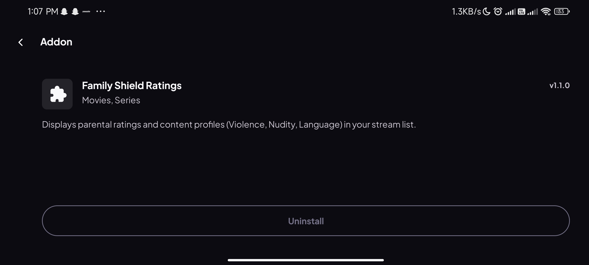
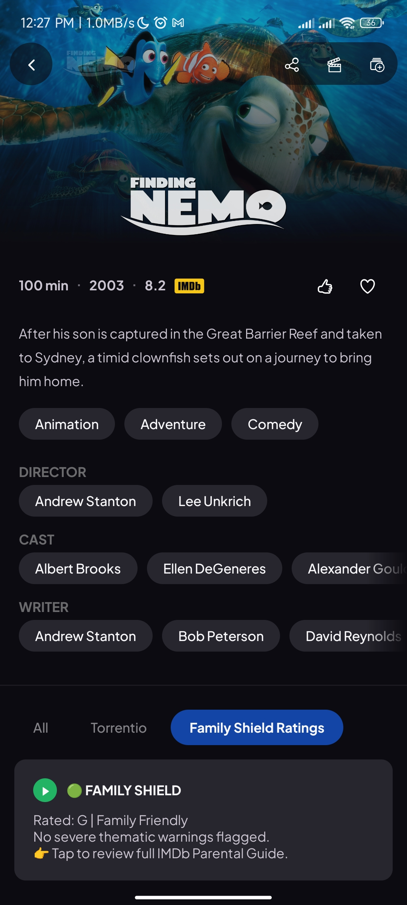
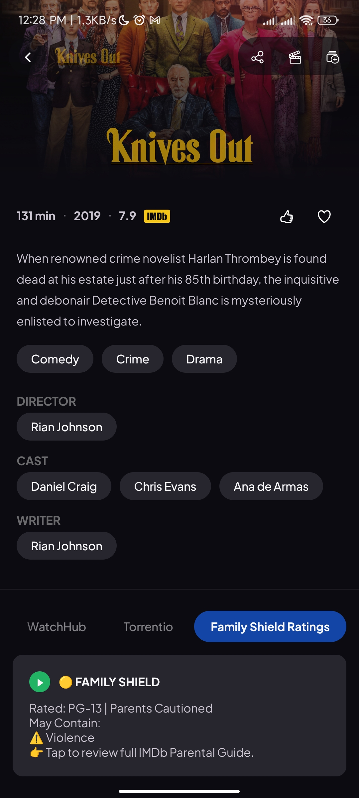
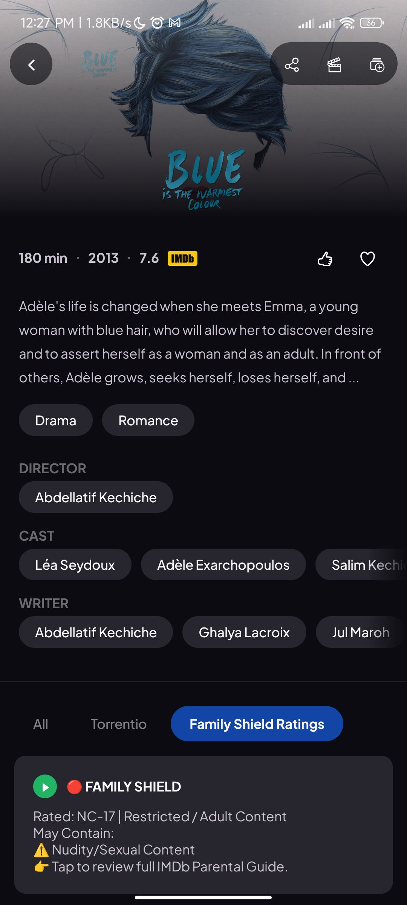

# 🛡️ Family Shield for Stremio

<p align="center">
  
</p>

<p align="center">
  <strong>Age Ratings, Content Warnings, and Family-Friendly Guidance directly inside Stremio.</strong>
</p>

---

## 📖 Overview

When using Stremio on a shared family TV, it's often difficult to know whether a movie contains mature content before someone presses **Play**.

**Family Shield** adds a highly visible informational stream tile above your normal stream providers, displaying:

* Official age ratings (G, PG, PG-13, R, NC-17, etc.)
* Family suitability indicators
* Violence warnings
* Sexual content warnings
* Strong language warnings

The add-on is completely serverless, lightweight, and requires no user configuration.

---

## 📸 Screenshots

|              🟢 Family Friendly             |        🟡 Parents Cautioned (Teen)        |                   🔴 Restricted (Adult)                   |
| :-----------------------------------------: | :---------------------------------------: | :-------------------------------------------------------: |
|  |  |  |
|              *Finding Nemo (G)*             |            *Knives Out (PG-13)*           |            *Blue Is the Warmest Colour (NC-17)*           |

---

## ✨ Features

### 🏷️ Age Ratings

Displays official maturity ratings directly within the stream list:

* G
* PG
* PG-13
* R
* NC-17
* TV ratings (where available)

### ⚠️ Content Warnings

Analyzes metadata and content keywords to identify:

* Violence
* Sexual Content / Nudity
* Strong Language
* Adult Themes

### 🎨 Easy-to-Understand Color Coding

| Color     | Meaning                |
| --------- | ---------------------- |
| 🟢 Green  | Family Friendly        |
| 🟡 Yellow | Parents Cautioned      |
| 🔴 Red    | Mature / Adult Content |

### 🚀 Fast & Lightweight

* Hosted on Cloudflare Workers
* Edge-cached responses
* No database required
* No premium services required

### 🔒 Non-Intrusive

Family Shield:

✅ Adds an informational stream tile

✅ Leaves Cinemeta untouched

✅ Does not modify posters

✅ Does not alter descriptions

✅ Does not interfere with library syncing

---

## 📥 Installation

Because GitHub blocks `stremio://` links, install manually:

### Step 1

Open **Stremio**

### Step 2

Navigate to:

**Add-ons → Community Add-ons**

### Step 3

Paste the following URL into the **Addon URL** field:

```text
https://family-shield.saurabhshakya078.workers.dev/manifest.json
```

### Step 4

Click **Install**

---

## 💡 Recommended Add-on Order

Stremio sorts stream providers according to installation order.

To place Family Shield above providers such as:

* Torrentio
* KnightCrawler
* MediaFusion
* Comet

Install Family Shield first, or reinstall your stream provider add-ons afterward.

This places the Family Shield warning tile at the top of the stream list.

---

## ⚙️ How It Works

1. Stremio requests streams for an IMDb title.
2. Family Shield receives the request.
3. The add-on fetches:

   * Certification data
   * Content keywords
4. Metadata is evaluated.
5. A safety classification is generated.
6. An informational stream tile is returned.
7. Results are cached globally by Cloudflare.

---

## 🏗️ Self-Hosting

You can deploy your own instance for free.

### Requirements

* Cloudflare Account
* TMDb Developer Account
* TMDb Read Access Token

### Deployment

1. Create a new Cloudflare Worker.
2. Copy the contents of `worker.js`.
3. Create a TMDb API token.
4. Add a Worker Secret named:

```text
TMDB_API_KEY
```

5. Deploy the Worker.
6. Use your own `workers.dev` URL.

---

## 🔧 Technology Stack

* Cloudflare Workers
* TMDb API
* JavaScript
* Stremio Add-on SDK

---

## ⚠️ Disclaimer

Family Shield is an informational add-on only.

It does **not**:

* Block playback
* Hide streams
* Enforce parental controls
* Guarantee content accuracy

Ratings and content indicators rely on publicly available metadata and community-maintained information from TMDb.

Parents and guardians should always make their own viewing decisions.

---

## ❤️ Support the Project

If you find Family Shield useful:

* ⭐ Star the repository
* 🐞 Report issues
* 💡 Suggest improvements
* 🔀 Submit pull requests

Every contribution helps make Stremio more family-friendly.

---

Made with ❤️ for families using Stremio.
